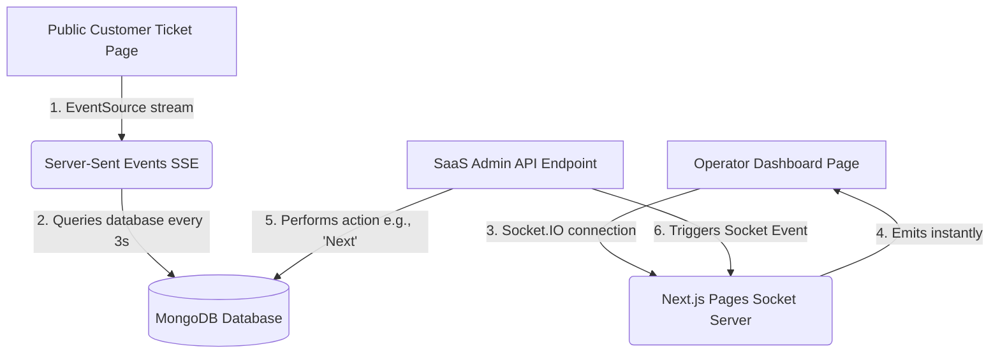

# 🚀 FlowQ — Universal Queue & Flow Management System

FlowQ (also referred to as HealthQ) is a premium, real-time **Universal Queue Management SaaS** built to streamline customer flow and virtual ticketing for physical locations such as hospitals, clinics, banks, government branches, and salons.

With FlowQ, businesses can digitize their waitlists, and customers can take virtual tokens on their mobile devices to monitor wait times and positions in real-time—no native mobile app install required.

---

## ✨ Features

*   🏢 **Multi-Location & Organization Support**: Coordinate multiple branches under a unified SaaS dashboard.
*   🛠️ **Custom Service Lines**: Define distinct service queues (e.g., *Pharmacy Counter*, *Account Opening*, *General Consultation*) with custom estimated service times.
*   📢 **Live Operator Control Panel**: Staff can call next customers, mark them complete, skip absentees, or transfer customers across services with instant updates.
*   🎟️ **Virtual Mobile Ticketing**: Public-facing kiosk pages (`/join/[serviceId]`) allow users to enter their names, check estimated wait times, and receive instant token alerts.
*   📈 **Real-Time Analytics Dashboard**: Monitor current queue loads, completed traffic volumes, and average wait metrics.
*   ⚡ **Smart Dual Real-Time Architecture**: Uses **Socket.IO** for zero-latency operator interactions and **Server-Sent Events (SSE)** for lightweight, high-volume public ticket feeds.

---

## 🛠️ Technology Stack

*   **Framework**: [Next.js](https://nextjs.org/) (App Router & Pages API)
*   **Language**: [TypeScript](https://www.typescriptlang.org/)
*   **Database**: [MongoDB](https://www.mongodb.com/) via [Mongoose](https://mongoosejs.com/)
*   **Authentication**: [Supabase Auth](https://supabase.com/docs/guides/auth)
*   **Real-time Communication**: [Socket.IO](https://socket.io/) (Staff Dashboard) & [Server-Sent Events (SSE)](https://developer.mozilla.org/en-US/docs/Web/API/Server-sent_events) (Public Tickets)
*   **Styling**: [Tailwind CSS v4](https://tailwindcss.com/) & [Lucide Icons](https://lucide.dev/)

---

## 📐 System Architecture

FlowQ employs a robust, hybrid architecture to serve administrative operators and massive customer traffic optimally:



### 🎯 Key Architectural Decisions:
1.  **Staff Dashboards (WebSockets / Socket.IO)**: Low-latency, bi-directional communication ensures immediate updates as counters move. Kept lightweight by limiting connections only to active branch staff.
2.  **Public Ticket Pages (Server-Sent Events / SSE)**: Avoids heavy WebSocket overhead on public mobile devices. Uses a Next.js `ReadableStream` (`app/api/queue/stream/route.ts`) to query MongoDB and update customer devices on a 3-second heartbeat, automatically terminating cleanly when a user exits.
3.  **Database Strategy**: Queue documents embed the full active line as a Mongoose sub-document array (`ICustomer[]`). This avoids complex database joins and ensures queue operations are fast and highly consistent.

---

## 📂 Project Structure

```bash
├── app/
│   ├── api/                   # Next.js Route Handlers
│   │   ├── organization/      # Organization and analytics management routes
│   │   ├── service/           # Service definition and public retrieval routes
│   │   └── queue/             # Core queue control (join, next, complete, skip, transfer, stream)
│   ├── dashboard/             # Staff Console pages (Overview, Analytics, Organizations, Services)
│   ├── join/[serviceId]/      # Public customer ticket kiosks
│   ├── login/                 # Staff Auth interface (Supabase connection)
│   ├── globals.css            # Tailwind CSS theme configurations
│   └── layout.tsx             # Main React entry shell
├── lib/
│   ├── api-client.ts          # Client-side API fetcher injecting JWT Bearer token
│   ├── auth.ts                # Server-side Supabase JWT verification utilities
│   ├── mongodb.ts             # Cached Mongoose database client connection
│   ├── socket.ts              # Server-side Socket.IO server initialization
│   ├── socket-client.ts       # Client-side Socket.IO singleton manager
│   ├── socket-events.ts       # Real-time event dispatch room filters
│   └── supabaseClient.ts      # Client-side Supabase Auth configuration
├── models/                    # MongoDB Schemas (Organization, Service, Queue)
├── pages/api/socket/io.ts     # Pages Router bridge to bind Socket.IO onto Next.js HTTP server
├── types/                     # Shared TypeScript typings
├── scripts/                   # Integration simulation test scripts
└── tailwind.config.js         # Styling preferences and animations
```

---

## 🚀 Getting Started

### 📋 Prerequisites
Ensure you have the following installed:
*   [Node.js](https://nodejs.org/) (v18.x or later)
*   [MongoDB Instance](https://www.mongodb.com/) (Local or MongoDB Atlas)
*   [Supabase Project](https://supabase.com/) (For Authentication)

### ⚙️ Environment Setup
Create a `.env.local` file in the root directory and configure the following variables:

```env
# MongoDB Connection
MONGODB_URI=your_mongodb_connection_string

# Supabase Auth Configuration
NEXT_PUBLIC_SUPABASE_URL=your_supabase_project_url
NEXT_PUBLIC_SUPABASE_ANON_KEY=your_supabase_anonymous_api_key
```

### 💻 Installation
1. Clone the repository and navigate to the directory:
   ```bash
   cd HealthQ
   ```
2. Install dependencies:
   ```bash
   npm install
   ```
3. Run the development server:
   ```bash
   npm run dev
   ```
4. Access the application:
   * **Operator Console**: Open [http://localhost:3000/dashboard](http://localhost:3000/dashboard) (redirects to login)
   * **Authentication**: Create an account or sign in to configure your first organization branch.

---

## 🧪 Testing the APIs
You can test the queue endpoints end-to-end using the included node simulation scripts:

1. Start your local server: `npm run dev`
2. Run the general queue workflow simulator:
   ```bash
   npx ts-node scripts/testQueueFlow.ts
   ```
3. Run the customer queue transfer simulator:
   ```bash
   npx ts-node scripts/testTransferFlow.ts
   ```

---

## 📝 License
This project is private and proprietary.
